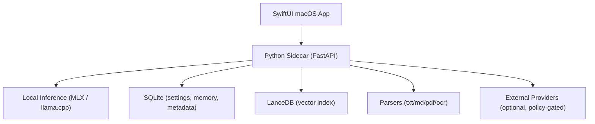

# PLOS for Mac (日本語)

[](#要件)
[](#アーキテクチャ)
[](#アーキテクチャ)
[](LICENSE)

macOS向けローカルファーストAIワークスペース。

[English](README.md) | [한국어](README.ko.md) | 日本語

## PLOSとは
PLOSは SwiftUI アプリと Python サイドカー(FastAPI)を組み合わせ、対話・検索・メモリ処理をできるだけローカルで実行します。

- ワークスペースファイルに対するローカル対話 + RAG（出典表示）
- ポリシー制御の外部Web/プロバイダ呼び出し
- メモリ階層（Session / Workspace / Preference / Pinned）
- ハードウェアに応じたモデルカタログ
- 一般会話 Direct-First 応答ポリシー

## ランタイム状況
- ローカル推論バックエンド: `MLX`, `llama.cpp`（主要経路）
- 外部プロバイダ（任意）: `OpenAI`, `Anthropic`
- Ollama: 現在の main ブランチでは一次ランタイムとして未統合

## アーキテクチャ


## リポジトリ構成
- `PLOS/`: macOS アプリ（SwiftUI）
- `sidecar/local_ai_core/`: 推論/メモリ/API コア
- `sidecar/tests/`: サイドカーテスト
- `PLOSTests/`, `PLOSUITests/`: アプリテスト

## 要件
- Apple Silicon Mac 推奨（Mシリーズ）
- macOS 14+
- Xcode 15+
- Python 3.11+
- OCR（任意）: `tesseract`, `poppler`

## クイックスタート
### 1) クローン
```bash
git clone https://github.com/adgk2349/PLOS-for-Mac.git
cd PLOS-for-Mac
```

### 2) サイドカー環境
```bash
cd sidecar
python3 -m venv .venv
source .venv/bin/activate
pip install -e .
pip install -e '.[test]'
```

### 3) OCRツール（任意）
```bash
brew install tesseract poppler
```

### 4) アプリ実行
- Xcodeで `PLOS.xcodeproj` を開く
- `PLOS` ターゲットを実行
- サイドカーのライフサイクルはアプリが自動管理
- 初回確認: チャット画面が開き、簡単なプロンプトに応答すれば正常起動

## サイドカー単体起動（開発）
```bash
cd sidecar
source .venv/bin/activate
export LOCAL_AI_SESSION_TOKEN=dev-token
export LOCAL_AI_DATA_DIR="$(pwd)/data"
uvicorn local_ai_core.main:create_app --factory --host 127.0.0.1 --port 8787
```

`dev-token` はローカル開発用のサンプル値です。

## モデル推奨レンジ（実運用目安）
- 16GB: 7B/8B中心、12B/14Bは限定的
- 64GB+: 20B/70Bクラス
- 256GB+: GPT-OSS 120Bクラス
- 500GB+: Kimi 2.5 / Qwen 3.5 397Bクラス

## テスト
### サイドカー
```bash
cd sidecar
source .venv/bin/activate
pytest -q
```

### 重点回帰
```bash
pytest -q tests/test_v2_pipeline.py tests/test_local_inference_sanitize.py tests/test_memory_service_digest.py
```

### アプリテスト
```bash
xcodebuild \
  -project PLOS.xcodeproj \
  -scheme PLOS \
  -destination 'platform=macOS' \
  test
```

## ドキュメント
- [CONTRIBUTING.ja.md](CONTRIBUTING.ja.md)
- [PERFORMANCE.ja.md](PERFORMANCE.ja.md)
- [CHANGELOG.ja.md](CHANGELOG.ja.md)
- [CHANGELOG.en.md](CHANGELOG.en.md)
- [CHANGELOG.ko.md](CHANGELOG.ko.md)

## ライセンス
MIT。詳細は [LICENSE](LICENSE)。
