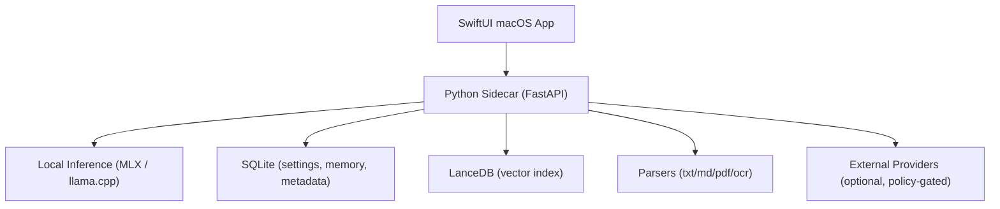

# PLOS for Mac (한국어)

[](#요구-사항)
[](#아키텍처)
[](#아키텍처)
[](LICENSE)

macOS용 로컬 우선 AI 워크스페이스.

[English](README.md) | 한국어 | [日本語](README.ja.md)

## PLOS가 하는 일
PLOS는 SwiftUI 앱 + Python 사이드카(FastAPI) 구조로, 대화/검색/메모리 워크플로우를 가능한 한 로컬에서 처리합니다.

- 워크스페이스 파일 기반 로컬 대화 + RAG(출처 표시)
- 정책 기반 외부 웹/프로바이더 호출
- 메모리 계층(Session / Workspace / Preference / Pinned)
- 하드웨어 등급 기반 모델 카탈로그
- 일반 대화 Direct-First 응답 정책

## 런타임 상태
- 로컬 추론 백엔드: `MLX`, `llama.cpp` (기본 경로)
- 외부 프로바이더(선택): `OpenAI`, `Anthropic`
- Ollama: 현재 main 브랜치에서 1급 런타임으로 통합되어 있지 않음

## 아키텍처


## 저장소 구조
- `PLOS/`: macOS 앱(SwiftUI)
- `sidecar/local_ai_core/`: 추론/메모리/API 코어
- `sidecar/tests/`: 사이드카 테스트
- `PLOSTests/`, `PLOSUITests/`: 앱 테스트

## 요구 사항
- Apple Silicon Mac 권장(M 시리즈)
- macOS 14+
- Xcode 15+
- Python 3.11+
- OCR 선택 도구: `tesseract`, `poppler`

## 빠른 시작
### 1) 클론
```bash
git clone https://github.com/adgk2349/PLOS-for-Mac.git
cd PLOS-for-Mac
```

### 2) 사이드카 환경
```bash
cd sidecar
python3 -m venv .venv
source .venv/bin/activate
pip install -e .
pip install -e '.[test]'
```

### 3) OCR 도구(선택)
```bash
brew install tesseract poppler
```

### 4) 앱 실행
- Xcode에서 `PLOS.xcodeproj` 열기
- `PLOS` 타깃 실행
- 앱이 사이드카 라이프사이클을 자동 관리
- 첫 실행 확인: 채팅 화면이 열리고 간단한 프롬프트에 응답하면 정상 기동

## 사이드카 단독 실행(개발)
```bash
cd sidecar
source .venv/bin/activate
export LOCAL_AI_SESSION_TOKEN=dev-token
export LOCAL_AI_DATA_DIR="$(pwd)/data"
uvicorn local_ai_core.main:create_app --factory --host 127.0.0.1 --port 8787
```

`dev-token`은 로컬 개발용 예시값입니다.

## 모델 권장 구간(실사용 기준)
- 16GB: 7B/8B 중심, 12B/14B 제한적 시도
- 64GB+: 20B/70B급
- 256GB+: GPT-OSS 120B급
- 500GB+: Kimi 2.5 / Qwen 3.5 397B급

## 테스트
### 사이드카
```bash
cd sidecar
source .venv/bin/activate
pytest -q
```

### 핵심 회귀
```bash
pytest -q tests/test_v2_pipeline.py tests/test_local_inference_sanitize.py tests/test_memory_service_digest.py
```

### 앱 테스트
```bash
xcodebuild \
  -project PLOS.xcodeproj \
  -scheme PLOS \
  -destination 'platform=macOS' \
  test
```

## 문서
- [CONTRIBUTING.ko.md](CONTRIBUTING.ko.md)
- [PERFORMANCE.ko.md](PERFORMANCE.ko.md)
- [CHANGELOG.ko.md](CHANGELOG.ko.md)
- [CHANGELOG.en.md](CHANGELOG.en.md)
- [CHANGELOG.ja.md](CHANGELOG.ja.md)

## 라이선스
MIT. [LICENSE](LICENSE) 참고.
