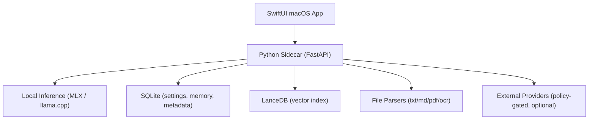

# PLOS for Mac

Local-first AI workspace for macOS.

English | [한국어](README.ko.md) | [日本語](README.ja.md)

## Overview
PLOS combines a native SwiftUI desktop app with a local FastAPI sidecar to deliver private, citation-aware AI workflows on your machine.

- Local-first chat and RAG over your workspace files
- Hybrid routing (local by default, external provider only when policy allows)
- Multi-layer memory (session/workspace/preferences/pinned)
- Model catalog with hardware-aware recommendations
- Conversational direct-first response policy for natural chat

## Architecture


## Repository Layout
- `PLOS/`: SwiftUI macOS app
- `sidecar/local_ai_core/`: FastAPI sidecar core
- `sidecar/tests/`: sidecar tests
- `PLOSTests/`, `PLOSUITests/`: Swift test targets

## System Requirements
- Apple Silicon Mac recommended (M-series)
- macOS 14+
- Xcode 15+
- Python 3.11+
- Optional OCR dependencies:
  - `tesseract`
  - `poppler`

## Installation
### 1) Clone
```bash
git clone https://github.com/adgk2349/PLOS-for-Mac.git
cd PLOS-for-Mac
```

### 2) Prepare sidecar environment
```bash
cd sidecar
python3 -m venv .venv
source .venv/bin/activate
pip install -e .
pip install -e '.[test]'
```

### 3) (Optional) OCR tooling
```bash
brew install tesseract poppler
```

### 4) Run app
- Open `PLOS.xcodeproj` in Xcode
- Run the `PLOS` target
- The app starts/stops sidecar lifecycle automatically

## Sidecar Standalone (Dev)
```bash
cd sidecar
source .venv/bin/activate
export LOCAL_AI_SESSION_TOKEN=dev-token
export LOCAL_AI_DATA_DIR="$(pwd)/data"
uvicorn local_ai_core.main:create_app --factory --host 127.0.0.1 --port 8787
```

## Model Setup
Use **Settings > Model Catalog** in the app to install and activate models.

Practical hardware tiers (current catalog policy):
- 16GB: 7B/8B class, up to 12B~14B upper-bound attempts
- 64GB+: 20B/70B class
- 256GB+: GPT-OSS 120B
- 500GB+: Kimi 2.5 / Qwen 3.5 397B class

## Memory Model
PLOS separates memory by scope:
- Session memory: isolated per chat room
- Workspace memory: project-level context
- Preference/pinned memory: user-controlled durable facts

Session memory is designed to avoid cross-room leakage; global memory is explicit and user-managed.

## Testing
### Sidecar tests
```bash
cd sidecar
source .venv/bin/activate
pytest -q
```

### Focused regression suites
```bash
pytest -q tests/test_v2_pipeline.py tests/test_local_inference_sanitize.py tests/test_memory_service_digest.py
```

### Swift tests (Xcode CLI)
```bash
xcodebuild \
  -project PLOS.xcodeproj \
  -scheme PLOS \
  -destination 'platform=macOS' \
  test
```

## Performance Testing
See [PERFORMANCE.md](PERFORMANCE.md) for repeatable benchmark scenarios:
- chat latency
- RAG retrieval quality checks
- summary quality checks
- model profile comparisons

## Contributing
See [CONTRIBUTING.md](CONTRIBUTING.md).

## Changelog
- [CHANGELOG.en.md](CHANGELOG.en.md)
- [CHANGELOG.ko.md](CHANGELOG.ko.md)
- [CHANGELOG.ja.md](CHANGELOG.ja.md)

## License
This project is licensed under the MIT License. See [LICENSE](LICENSE).
