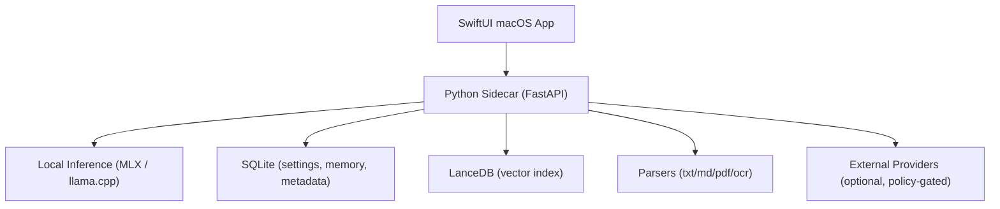

# PLOS for Mac

[](#system-requirements)
[](#architecture)
[](#architecture)
[](LICENSE)

Local-first AI workspace for macOS.

English | [한국어](README.ko.md) | [日本語](README.ja.md)

## Why PLOS
PLOS combines a native SwiftUI app and a local Python sidecar to run chat, retrieval, and memory workflows primarily on-device.

- Local-first chat and retrieval (RAG) over workspace files
- Policy-gated external web/provider usage
- Multi-layer memory (session/workspace/preferences/pinned)
- Hardware-aware local model catalog
- Conversational direct-first response policy

## Architecture


## Repository Layout
- `PLOS/`: macOS app (SwiftUI)
- `sidecar/local_ai_core/`: reasoning, inference, memory, API
- `sidecar/tests/`: sidecar tests
- `PLOSTests/`, `PLOSUITests/`: app tests

## System Requirements
- Apple Silicon Mac recommended (M-series)
- macOS 14+
- Xcode 15+
- Python 3.11+
- Optional OCR tools: `tesseract`, `poppler`

## Quick Start
### 1) Clone
```bash
git clone https://github.com/adgk2349/PLOS-for-Mac.git
cd PLOS-for-Mac
```

### 2) Sidecar environment
```bash
cd sidecar
python3 -m venv .venv
source .venv/bin/activate
pip install -e .
pip install -e '.[test]'
```

### 3) Optional OCR
```bash
brew install tesseract poppler
```

### 4) Run app
- Open `PLOS.xcodeproj` in Xcode
- Run `PLOS` target
- Sidecar lifecycle is managed by the app

## Sidecar Standalone (Dev)
```bash
cd sidecar
source .venv/bin/activate
export LOCAL_AI_SESSION_TOKEN=dev-token
export LOCAL_AI_DATA_DIR="$(pwd)/data"
uvicorn local_ai_core.main:create_app --factory --host 127.0.0.1 --port 8787
```

## Model Tiers (Practical)
- 16GB: 7B/8B class, limited 12B/14B attempts
- 64GB+: 20B/70B class
- 256GB+: GPT-OSS 120B class
- 500GB+: Kimi 2.5 / Qwen 3.5 397B class

## Testing
### Sidecar
```bash
cd sidecar
source .venv/bin/activate
pytest -q
```

### Focused regressions
```bash
pytest -q tests/test_v2_pipeline.py tests/test_local_inference_sanitize.py tests/test_memory_service_digest.py
```

### App tests
```bash
xcodebuild \
  -project PLOS.xcodeproj \
  -scheme PLOS \
  -destination 'platform=macOS' \
  test
```

## Docs
- [CONTRIBUTING.md](CONTRIBUTING.md)
- [PERFORMANCE.md](PERFORMANCE.md)
- [PLUGIN_RUNTIME_SPEC.md](PLUGIN_RUNTIME_SPEC.md)
- [CHANGELOG.en.md](CHANGELOG.en.md)
- [CHANGELOG.ko.md](CHANGELOG.ko.md)
- [CHANGELOG.ja.md](CHANGELOG.ja.md)

## License
MIT. See [LICENSE](LICENSE).
